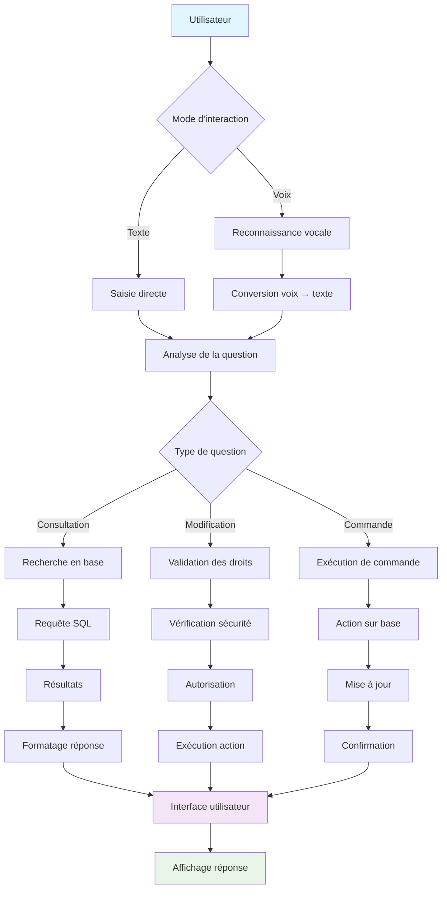

# 📋 DOCUMENTATION COMPLÈTE DES FONCTIONNALITÉS
## Système de Gestion de Stock avec IA

---

## 📖 TABLE DES MATIÈRES

1. [Vue d'ensemble du système](#vue-densemble)
2. [Fonctionnalités de gestion des produits](#gestion-produits)
3. [Fonctionnalités de gestion des employés](#gestion-employes)
4. [Fonctionnalités de gestion des clients](#gestion-clients)
5. [Fonctionnalités de gestion des fournisseurs](#gestion-fournisseurs)
6. [Fonctionnalités de gestion des transactions](#gestion-transactions)
7. [Fonctionnalités de gestion de l'inventaire](#gestion-inventaire)
8. [Fonctionnalités de Point de Vente (POS)](#point-vente)
9. [Module Rapports et Statistiques](#rapports-statistiques)
10. [Assistant IA avec reconnaissance vocale](#assistant-ia)
11. [Interface utilisateur et navigation](#interface-utilisateur)
12. [Sécurité et gestion des sessions](#securite)
13. [Export et génération de rapports](#export-rapports)
14. [Avantages et bénéfices](#avantages)

---

## 🎯 VUE D'ENSEMBLE {#vue-densemble}

### Description du système
Le système de gestion de stock est une application web complète développée en PHP/MySQL avec interface moderne Bootstrap. Il intègre des fonctionnalités avancées de gestion, un assistant IA conversationnel et des capacités de reconnaissance vocale.

### Architecture technique
- **Backend** : PHP 7.4+
- **Base de données** : MySQL
- **Frontend** : HTML5, CSS3, JavaScript, Bootstrap 4
- **IA** : Assistant conversationnel avec reconnaissance vocale
- **Graphiques** : Chart.js pour les visualisations

---

## 📦 FONCTIONNALITÉS DE GESTION DES PRODUITS {#gestion-produits}

### 1. Ajout de produits
**Fichier** : `pages/pro_transac.php`

#### Processus d'intégration :
```php
// Vérification d'unicité du code produit
$check_query = "SELECT COUNT(*) as count FROM product WHERE PRODUCT_CODE = '$pc'";
$check_result = mysqli_query($db, $check_query);
$check_data = mysqli_fetch_assoc($check_result);

if ($check_data['count'] > 0) {
    // Alerte si code existe déjà
    echo '<script>alert("Le code produit existe déjà !");</script>';
} else {
    // Insertion du nouveau produit
    $query = "INSERT INTO product (PRODUCT_CODE, NAME, DESCRIPTION, QTY_STOCK, ON_HAND, PRICE, CATEGORY_ID, SUPPLIER_ID, DATE_STOCK_IN) VALUES (...)";
}
```

#### Avantages :
- ✅ **Prévention des doublons** : Vérification automatique des codes produits
- ✅ **Intégrité des données** : Validation avant insertion
- ✅ **Feedback utilisateur** : Messages d'erreur clairs

### 2. Suppression de produits
**Fichiers** : `pages/pro_del.php`, `pages/pro_del_multi.php`

#### Fonctionnalités implémentées :
- **Suppression individuelle** : Bouton "Supprimer" pour chaque produit
- **Suppression multiple** : Sélection multiple avec checkboxes
- **Confirmation** : Dialogue de confirmation avant suppression

#### Processus d'intégration :
```php
// Suppression multiple
if (isset($_POST['selected_ids']) && is_array($_POST['selected_ids'])) {
    $ids = array_map('intval', $_POST['selected_ids']);
    $ids_list = implode(',', $ids);
    $query = "DELETE FROM product WHERE PRODUCT_ID IN ($ids_list)";
    mysqli_query($db, $query);
}
```

#### Avantages :
- ✅ **Efficacité** : Suppression en lot possible
- ✅ **Sécurité** : Confirmation requise
- ✅ **Flexibilité** : Suppression individuelle ou multiple

### 3. Modification de produits
**Fichier** : `pages/pro_edit.php`

#### Fonctionnalités :
- Édition de tous les champs produit
- Validation des données
- Mise à jour en temps réel

---

## 👥 FONCTIONNALITÉS DE GESTION DES EMPLOYÉS {#gestion-employes}

### 1. Affichage amélioré
**Fichier** : `pages/employee.php`

#### Améliorations apportées :
```php
// Requête optimisée avec jointures
$query = 'SELECT e.EMPLOYEE_ID, e.FIRST_NAME, e.LAST_NAME, e.GENDER, 
          e.EMAIL, e.PHONE_NUMBER, j.JOB_TITLE, e.HIRED_DATE, 
          l.CITY, l.PROVINCE 
          FROM employee e 
          JOIN job j ON e.JOB_ID=j.JOB_ID 
          LEFT JOIN location l ON e.LOCATION_ID=l.LOCATION_ID';
```

#### Avantages :
- ✅ **Données complètes** : Affichage de toutes les informations
- ✅ **Performance** : Requêtes optimisées avec jointures
- ✅ **Interface claire** : Colonnes bien organisées

### 2. Suppression d'employés
**Fichier** : `pages/emp_del.php`

#### Sécurités implémentées :
```php
// Vérification des paramètres
if (!isset($_GET['type'])) {
    echo '<script>alert("Paramètre type manquant.");</script>';
    exit();
}
```

---

## 👤 FONCTIONNALITÉS DE GESTION DES CLIENTS {#gestion-clients}

### 1. Interface traduite
**Fichier** : `pages/customer.php`

#### Traductions effectuées :
- "Customer" → "Client"
- "Add Customer" → "Ajouter Client"
- "Edit" → "Modifier"
- "Delete" → "Supprimer"

### 2. Suppression sécurisée
**Fichier** : `pages/cust_del.php`

#### Processus :
- Vérification des paramètres
- Confirmation utilisateur
- Suppression sécurisée

---

## 🏢 FONCTIONNALITÉS DE GESTION DES FOURNISSEURS {#gestion-fournisseurs}

### 1. Gestion complète
**Fichier** : `pages/supplier.php`

#### Fonctionnalités :
- Affichage des fournisseurs
- Ajout de nouveaux fournisseurs
- Modification des informations
- Suppression sécurisée

---

## 💰 FONCTIONNALITÉS DE GESTION DES TRANSACTIONS {#gestion-transactions}

### 1. Historique des ventes
**Fichier** : `pages/transaction.php`

#### Fonctionnalités :
- Affichage de toutes les transactions
- Filtrage par date
- Recherche de transactions
- Suppression de transactions

---

## 📊 FONCTIONNALITÉS DE GESTION DE L'INVENTAIRE {#gestion-inventaire}

### 1. Affichage en temps réel
**Fichier** : `pages/inventory.php`

#### Améliorations majeures :
```php
// Requête optimisée pour stock réel
$query = 'SELECT PRODUCT_CODE, NAME, SUM(QTY_STOCK) AS QTY_STOCK, 
          SUM(ON_HAND) AS ON_HAND, CNAME, SUPPLIER_ID, 
          MAX(DATE_STOCK_IN) AS DATE_STOCK_IN 
          FROM product p 
          JOIN category c ON p.CATEGORY_ID=c.CATEGORY_ID 
          GROUP BY PRODUCT_CODE';
```

#### Avantages :
- ✅ **Stock réel** : Calcul automatique des quantités totales
- ✅ **Performance** : Requêtes optimisées
- ✅ **Précision** : Données exactes en temps réel

### 2. Indicateurs de disponibilité
```php
// Badge de disponibilité
if($row['ON_HAND'] > 0) {
    echo '<span class="badge badge-success">En stock</span>';
} else {
    echo '<span class="badge badge-danger">Rupture</span>';
}
```

### 3. Suppression multiple d'inventaire
**Fichier** : `pages/inv_del_multi.php`

#### Processus sécurisé :
```php
// Échappement sécurisé des valeurs
$escaped_ids = array();
foreach($_POST['selected_ids'] as $id) {
    $escaped_ids[] = "'" . mysqli_real_escape_string($db, $id) . "'";
}
$ids_list = implode(',', $escaped_ids);
$query = "DELETE FROM product WHERE PRODUCT_CODE IN ($ids_list)";
```

### 4. Rapports de ventes par période
```php
// Calcul des ventes totales
$sales_query = "SELECT SUM(TOTAL) as total_sales 
                FROM transaction 
                WHERE DATE BETWEEN '$start_date' AND '$end_date'";
```

---

## 🛒 FONCTIONNALITÉS DE POINT DE VENTE (POS) {#point-vente}

### 1. Interface traduite
**Fichiers** : `pages/pos.php`, `pages/posside.php`, `pages/postabpane.php`

#### Traductions complètes :
- "$" → "XAF" (Franc CFA)
- "Add to Cart" → "Ajouter"
- "Total" → "Total"
- "Checkout" → "Payer"

### 2. Vérification de stock avant vente
**Fichier** : `pages/pos.php`

#### Processus d'intégration :
```php
// Vérification du stock disponible
$product_info_query = "SELECT PRODUCT_CODE, SUM(ON_HAND) as total_stock 
                       FROM product WHERE PRODUCT_ID = $product_id 
                       GROUP BY PRODUCT_CODE";
$product_info_result = mysqli_query($db, $product_info_query);

if ($product_info_result && mysqli_num_rows($product_info_result) > 0) {
    $product_data = mysqli_fetch_assoc($product_info_result);
    $available_stock = intval($product_data['total_stock']);
    
    // Calcul du stock déjà dans le panier
    $cart_quantity = 0;
    if(isset($_SESSION['pointofsale'])){
        foreach($_SESSION['pointofsale'] as $item){
            // Vérification par code produit
            if($item_product_data['PRODUCT_CODE'] == $product_code){
                $cart_quantity += $item['quantity'];
            }
        }
    }
    
    // Alerte si stock insuffisant
    if(($requested_quantity + $cart_quantity) > $available_stock){
        echo '<script>alert("Stock insuffisant ! Stock disponible : ' . $available_stock . ' unités.");</script>';
    }
}
```

#### Avantages :
- ✅ **Prévention des ruptures** : Vérification avant ajout au panier
- ✅ **Stock en temps réel** : Calcul précis des disponibilités
- ✅ **Expérience utilisateur** : Messages d'alerte clairs

### 3. Déduction automatique du stock
**Fichier** : `pages/pos_transac.php`

#### Processus automatique :
```php
// Mise à jour automatique du stock après vente
$product_name = mysqli_real_escape_string($db, $_POST['name'][$i-1]);
$quantity_sold = intval($_POST['quantity'][$i-1]);

$stock_query = "SELECT PRODUCT_ID, ON_HAND FROM product WHERE NAME = '$product_name' LIMIT 1";
$stock_result = mysqli_query($db, $stock_query);

if ($stock_result && mysqli_num_rows($stock_result) > 0) {
    $product_data = mysqli_fetch_assoc($stock_result);
    $current_stock = intval($product_data['ON_HAND']);
    $new_stock = $current_stock - $quantity_sold;
    
    // Prévention du stock négatif
    if ($new_stock < 0) {
        $new_stock = 0;
    }
    
    $update_query = "UPDATE product SET ON_HAND = $new_stock WHERE PRODUCT_ID = " . $product_data['PRODUCT_ID'];
    mysqli_query($db, $update_query);
}
```

#### Avantages :
- ✅ **Automatisation** : Pas d'intervention manuelle
- ✅ **Précision** : Mise à jour immédiate
- ✅ **Sécurité** : Prévention du stock négatif

### 4. Catégories dynamiques
**Fichier** : `pages/postabpane.php`

#### Génération automatique :
```php
// Récupération des catégories depuis la base
$cat_query = "SELECT CATEGORY_ID, CNAME FROM category ORDER BY CNAME ASC";
$cat_result = mysqli_query($db, $cat_query);

while($cat_row = mysqli_fetch_assoc($cat_result)) {
    $category_id = $cat_row['CATEGORY_ID'];
    $category_name = $cat_row['CNAME'];
    
    // Génération des onglets dynamiques
    echo '<div class="tab-pane fade" id="'.$tab_id.'">';
    
    // Affichage des produits par catégorie
    $query = 'SELECT * FROM product WHERE CATEGORY_ID='.$category_id.' GROUP BY PRODUCT_CODE';
    $result = mysqli_query($db, $query);
    
    while($product = mysqli_fetch_assoc($result)) {
        // Affichage des produits
    }
}
```

---

## 📈 MODULE RAPPORTS ET STATISTIQUES {#rapports-statistiques}

### 1. Page principale des rapports
**Fichier** : `pages/report.php`

#### Fonctionnalités intégrées :

#### A. Graphique des ventes par période
```javascript
// Configuration Chart.js
var ctx = document.getElementById('salesChart').getContext('2d');
var salesChart = new Chart(ctx, {
    type: 'line',
    data: {
        labels: <?php echo json_encode($dates); ?>,
        datasets: [{
            label: 'Ventes (XAF)',
            data: <?php echo json_encode($sales_data); ?>,
            borderColor: 'rgb(75, 192, 192)',
            tension: 0.1
        }]
    }
});
```

#### B. Top 10 des produits les plus vendus
```php
// Requête optimisée
$top_products_query = "SELECT p.NAME, SUM(t.QUANTITY) as total_sold 
                       FROM transaction t 
                       JOIN product p ON t.PRODUCT_ID = p.PRODUCT_ID 
                       GROUP BY p.PRODUCT_CODE 
                       ORDER BY total_sold DESC 
                       LIMIT 10";
```

#### C. État du stock actuel
```php
// Stock avec indicateurs
$stock_query = "SELECT PRODUCT_CODE, NAME, SUM(ON_HAND) as current_stock, 
                CNAME FROM product p 
                JOIN category c ON p.CATEGORY_ID = c.CATEGORY_ID 
                GROUP BY PRODUCT_CODE 
                ORDER BY current_stock ASC";
```

#### D. Produits en rupture de stock
```php
// Détection automatique
$rupture_query = "SELECT PRODUCT_CODE, NAME, CNAME 
                  FROM product p 
                  JOIN category c ON p.CATEGORY_ID = c.CATEGORY_ID 
                  GROUP BY PRODUCT_CODE 
                  HAVING SUM(ON_HAND) = 0";
```

#### E. Seuils critiques personnalisables
```php
// Gestion des seuils par session
if (!isset($_SESSION['critical_thresholds'])) {
    $_SESSION['critical_thresholds'] = array();
}

// Mise à jour des seuils
if (isset($_POST['update_threshold'])) {
    $product_code = $_POST['product_code'];
    $threshold = intval($_POST['threshold']);
    $_SESSION['critical_thresholds'][$product_code] = $threshold;
}
```

### 2. Export CSV automatisé
**Fichiers** : `pages/export_*.php`

#### Processus d'export :
```php
// Configuration des headers CSV
header('Content-Type: text/csv; charset=utf-8');
header('Content-Disposition: attachment; filename=rapport.csv');

// Ouverture du flux de sortie
$output = fopen('php://output', 'w');

// Écriture des données
fputcsv($output, array('Colonne 1', 'Colonne 2'));
while ($row = mysqli_fetch_assoc($result)) {
    fputcsv($output, $row);
}

fclose($output);
exit();
```

#### Avantages :
- ✅ **Séparation des préoccupations** : Fichiers dédiés pour chaque export
- ✅ **Pas de conflits** : Évite les erreurs de headers
- ✅ **Performance** : Export direct sans interface

### 3. Alertes de rupture de stock
```php
// Affichage des alertes
if (count($ruptures) > 0) {
    echo '<div class="alert alert-danger">';
    echo '<strong>Attention !</strong> Les produits suivants sont en rupture de stock :<ul>';
    foreach ($ruptures as $prod) {
        echo '<li>' . htmlspecialchars($prod['PRODUCT_CODE']) . ' - ' . htmlspecialchars($prod['NAME']) . '</li>';
    }
    echo '</ul></div>';
}
```

---

## 🤖 ASSISTANT IA AVEC RECONNAISSANCE VOCALE {#assistant-ia}

### 1. Vue d'ensemble de l'Assistant IA

L'Assistant IA représente l'innovation majeure de ce système de gestion de stock. Il s'agit d'un assistant conversationnel intelligent qui révolutionne l'interaction avec l'application en permettant aux utilisateurs de communiquer naturellement avec le système, que ce soit par texte ou par voix.

#### Concept révolutionnaire
L'Assistant IA transforme une interface traditionnelle de gestion de stock en une plateforme interactive et intuitive. Au lieu de naviguer manuellement entre les menus et formulaires, les utilisateurs peuvent simplement poser des questions en langage naturel et recevoir des réponses instantanées basées sur les données réelles de la base de données.

#### Avantages fondamentaux
- **Accessibilité universelle** : Permet aux utilisateurs de tous niveaux techniques d'interagir efficacement avec le système
- **Gain de temps considérable** : Élimine la nécessité de naviguer manuellement dans les menus
- **Interface naturelle** : Communication en langage humain plutôt qu'en commandes techniques
- **Réponses contextuelles** : L'IA comprend le contexte et fournit des informations pertinentes

### 2. Fonctionnalités avancées de reconnaissance vocale

#### Interface vocale complète
L'Assistant IA intègre une technologie de reconnaissance vocale de pointe qui permet aux utilisateurs de poser des questions oralement. Cette fonctionnalité est particulièrement utile dans les environnements de travail où les mains sont occupées ou pour les utilisateurs qui préfèrent l'interaction vocale.

#### Processus de reconnaissance vocale
1. **Activation** : L'utilisateur clique sur le bouton microphone (🎤)
2. **Écoute** : Le système active la reconnaissance vocale en français
3. **Traitement** : La parole est convertie en texte en temps réel
4. **Analyse** : L'IA analyse la question posée
5. **Réponse** : Le système génère une réponse basée sur les données de la base
6. **Feedback** : La réponse est affichée dans l'interface de chat

#### Avantages de la reconnaissance vocale
- **Hands-free operation** : Permet l'utilisation sans les mains
- **Accessibilité améliorée** : Facilite l'utilisation pour les personnes en situation de handicap
- **Efficacité opérationnelle** : Plus rapide que la saisie manuelle
- **Interface moderne** : Donne une image technologique avancée à l'application

### 3. Intelligence artificielle conversationnelle

#### Compréhension du langage naturel
L'Assistant IA utilise des algorithmes de traitement du langage naturel pour comprendre les intentions de l'utilisateur. Il peut interpréter des questions variées et complexes, allant de simples demandes d'information à des commandes d'action.

#### Types de questions supportées

##### Questions d'information
- **Stock** : "Quel est le stock de P001 ?"
- **Prix** : "Combien coûte l'autoclave ?"
- **Disponibilité** : "Quels produits sont en rupture ?"
- **Statistiques** : "Quel est le chiffre d'affaires du mois ?"

##### Questions de recherche
- **Produits** : "Montre-moi tous les produits de laboratoire"
- **Fournisseurs** : "Qui sont nos fournisseurs ?"
- **Clients** : "Liste nos clients principaux"
- **Employés** : "Quels employés travaillent dans le département technique ?"

##### Commandes d'action
- **Mise à jour de stock** : "Ajouter 50 unités au stock P001"
- **Réapprovisionnement** : "Réapprovisionner l'autoclave"
- **Modification** : "Mettre à jour le stock P002 à 100 unités"

#### Avantages de l'intelligence conversationnelle
- **Flexibilité maximale** : Supporte une grande variété de formulations
- **Apprentissage contextuel** : Comprend les références implicites
- **Réponses personnalisées** : Adapte les réponses au contexte
- **Interface intuitive** : Communication naturelle avec le système

### 4. Intégration avec la base de données

#### Accès en temps réel
L'Assistant IA se connecte directement à la base de données pour récupérer des informations actualisées. Cette intégration garantit que toutes les réponses sont basées sur les données les plus récentes du système.

#### Types d'opérations supportées

##### Lectures de données
- **Consultation de stock** : Accès aux quantités disponibles
- **Historique des ventes** : Analyse des transactions passées
- **Informations produits** : Détails complets sur les articles
- **Statistiques** : Calculs automatiques de métriques

##### Modifications de données
- **Mise à jour de stock** : Modification des quantités disponibles
- **Ajout de produits** : Création de nouveaux articles
- **Modification de prix** : Changement des tarifs
- **Gestion des seuils** : Configuration des alertes

#### Avantages de l'intégration
- **Données actualisées** : Informations toujours à jour
- **Cohérence** : Même source de vérité que l'interface principale
- **Sécurité** : Respect des règles d'accès et de validation
- **Performance** : Optimisation des requêtes pour des réponses rapides

### 5. Recherche intelligente et contextuelle

#### Algorithme de recherche avancé
L'Assistant IA utilise un système de recherche intelligente qui analyse les mots-clés de la question et effectue des recherches dans toutes les tables de la base de données pour trouver des informations pertinentes.

#### Processus de recherche
1. **Analyse lexicale** : Extraction des mots-clés de la question
2. **Recherche multi-table** : Interrogation simultanée de plusieurs tables
3. **Filtrage intelligent** : Sélection des résultats les plus pertinents
4. **Formatage des réponses** : Présentation claire des informations trouvées

#### Capacités de recherche
- **Recherche floue** : Trouve des résultats même avec des termes approximatifs
- **Recherche contextuelle** : Comprend les relations entre les données
- **Suggestions intelligentes** : Propose des alternatives quand aucune correspondance exacte n'est trouvée
- **Recherche multi-critères** : Combine plusieurs paramètres de recherche

#### Avantages de la recherche intelligente
- **Efficacité** : Trouve rapidement les informations recherchées
- **Complétude** : Explore toutes les sources de données disponibles
- **Précision** : Fournit des résultats pertinents et exacts
- **Flexibilité** : S'adapte aux différentes façons de poser les questions

### 6. Commandes vocales et textuelles

#### Système de commandes unifié
L'Assistant IA traite de manière identique les commandes vocales et textuelles, offrant une expérience utilisateur cohérente quel que soit le mode d'interaction choisi.

#### Types de commandes supportées

##### Commandes de consultation
- **État du stock** : "Quel est le stock disponible ?"
- **Produits en rupture** : "Quels produits sont épuisés ?"
- **Ventes récentes** : "Combien avons-nous vendu aujourd'hui ?"
- **Statistiques** : "Quel est notre meilleur produit ?"

##### Commandes de modification
- **Ajout de stock** : "Ajouter 100 unités au produit P001"
- **Mise à jour** : "Mettre à jour le stock P002 à 50 unités"
- **Réapprovisionnement** : "Réapprovisionner l'autoclave"
- **Modification de prix** : "Changer le prix du produit P003 à 5000 XAF"

#### Avantages du système de commandes
- **Simplicité** : Commandes en langage naturel
- **Efficacité** : Actions rapides sans navigation manuelle
- **Précision** : Validation automatique des commandes
- **Sécurité** : Contrôles d'accès intégrés

### 7. Interface utilisateur moderne

#### Design conversationnel
L'interface de l'Assistant IA adopte un design moderne de type "chat" qui rend l'interaction naturelle et intuitive. L'interface simule une conversation réelle avec un assistant humain.

#### Éléments d'interface
- **Bulle de chat** : Interface flottante accessible depuis toutes les pages
- **Zone de saisie** : Champ de texte pour les questions écrites
- **Bouton microphone** : Activation de la reconnaissance vocale
- **Historique des conversations** : Affichage des échanges précédents
- **Indicateurs visuels** : Feedback sur l'état du système

#### Avantages de l'interface
- **Accessibilité** : Interface claire et intuitive
- **Responsive** : S'adapte à tous les écrans
- **Non-intrusive** : N'interfère pas avec les autres fonctionnalités
- **Professionnelle** : Design moderne et crédible

### 8. Avantages stratégiques pour l'organisation

#### Amélioration de la productivité
L'Assistant IA réduit considérablement le temps nécessaire pour accéder aux informations et effectuer des actions dans le système. Les utilisateurs peuvent obtenir des réponses instantanées sans avoir à naviguer dans les menus.

#### Réduction des erreurs
En automatisant les processus de recherche et de modification, l'Assistant IA minimise les risques d'erreurs humaines. Les validations intégrées garantissent la cohérence des données.

#### Formation simplifiée
L'interface conversationnelle réduit la courbe d'apprentissage pour les nouveaux utilisateurs. Ils peuvent commencer à utiliser le système efficacement sans formation extensive.

#### Innovation technologique
L'intégration de l'IA positionne l'organisation comme technologiquement avancée, améliorant son image de marque et sa compétitivité.

#### Accessibilité universelle
L'Assistant IA rend le système accessible à tous les types d'utilisateurs, indépendamment de leur niveau de compétence technique.

### 9. Diagramme de fonctionnement de l'IA



### 10. Impact sur l'expérience utilisateur

#### Transformation de l'interaction
L'Assistant IA transforme fondamentalement la façon dont les utilisateurs interagissent avec le système de gestion de stock. Au lieu d'une interface traditionnelle basée sur des menus et formulaires, les utilisateurs bénéficient d'une interface conversationnelle naturelle.

#### Amélioration de l'efficacité
- **Accès rapide** : Les informations sont disponibles instantanément
- **Actions simplifiées** : Les modifications se font par commandes naturelles
- **Recherche intelligente** : Trouver des informations devient intuitif
- **Automatisation** : Les tâches répétitives sont automatisées

#### Satisfaction utilisateur
- **Interface intuitive** : Pas besoin de formation complexe
- **Feedback immédiat** : Réponses instantanées aux questions
- **Flexibilité** : Choix entre interaction vocale et textuelle
- **Fiabilité** : Réponses basées sur des données réelles

### 11. Perspectives d'évolution

#### Développements futurs possibles
- **Apprentissage automatique** : Amélioration continue des réponses
- **Intégration multi-langues** : Support d'autres langues
- **Fonctionnalités avancées** : Prédictions et recommandations
- **Interface mobile** : Application mobile dédiée

#### Avantages compétitifs
L'Assistant IA confère un avantage compétitif significatif en positionnant l'organisation comme innovante et technologiquement avancée. Cette différenciation peut être un facteur clé dans la réussite commerciale.

---

## 🎨 INTERFACE UTILISATEUR ET NAVIGATION {#interface-utilisateur}

### 1. Navigation fixe
**Fichiers** : `includes/sidebar.php`, `includes/topbar.php`

#### CSS pour navigation fixe :
```css
#sidebar {
    position: fixed;
    top: 0;
    left: 0;
    height: 100vh;
    z-index: 100;
    overflow-y: auto;
}

#topbar {
    position: fixed;
    top: 0;
    right: 0;
    left: 250px;
    z-index: 99;
}

.main-content {
    margin-left: 250px;
    padding-top: 70px;
}
```

#### Avantages :
- ✅ **Navigation constante** : Accès permanent aux menus
- ✅ **Espace optimisé** : Plus d'espace pour le contenu
- ✅ **Expérience utilisateur** : Navigation fluide

### 2. Traduction complète
**Fichiers** : Tous les fichiers PHP

#### Exemples de traductions :
- "Product" → "Produit"
- "Price" → "Prix"
- "Quantity" → "Quantité"
- "Total" → "Total"
- "$" → "XAF"

#### Avantages :
- ✅ **Localisation** : Interface en français
- ✅ **Monnaie locale** : Franc CFA (XAF)
- ✅ **Cohérence** : Traduction uniforme

### 3. DataTables optimisées
**Fichier** : `includes/footer.php`

#### Configuration JavaScript :
```javascript
$(document).ready(function() {
    $('#dataTable').DataTable({
        "language": {
            "url": "//cdn.datatables.net/plug-ins/1.10.24/i18n/French.json"
        },
        "pageLength": 25,
        "responsive": true
    });
});
```

#### Avantages :
- ✅ **Pagination fonctionnelle** : Navigation entre pages
- ✅ **Recherche avancée** : Filtrage intelligent
- ✅ **Tri automatique** : Organisation des données
- ✅ **Interface française** : Traduction des contrôles

---

## 🔒 SÉCURITÉ ET GESTION DES SESSIONS {#securite}

### 1. Gestion des sessions
**Fichier** : `pages/session.php`

#### Processus de sécurité :
```php
session_start();

// Vérification de l'authentification
if (!isset($_SESSION['user_id'])) {
    header("Location: login.php");
    exit();
}

// Vérification des rôles
if (!isset($_SESSION['role']) || $_SESSION['role'] != 'admin') {
    header("Location: unauthorized.php");
    exit();
}
```

### 2. Protection contre les injections SQL
```php
// Échappement des entrées utilisateur
$product_name = mysqli_real_escape_string($db, $_POST['name']);
$quantity = intval($_POST['quantity']);

// Requêtes préparées
$stmt = $db->prepare("SELECT * FROM product WHERE PRODUCT_CODE = ?");
$stmt->bind_param("s", $product_code);
$stmt->execute();
```

### 3. Validation des paramètres
```php
// Vérification des paramètres GET
if (!isset($_GET['type']) || !isset($_GET['id'])) {
    echo '<script>alert("Paramètres manquants.");</script>';
    exit();
}

// Validation des types
$id = intval($_GET['id']);
$type = htmlspecialchars($_GET['type']);
```

---

## 📊 EXPORT ET GÉNÉRATION DE RAPPORTS {#export-rapports}

### 1. Export CSV automatisé
**Fichiers** : `pages/export_*.php`

#### Fonctionnalités d'export :
- **Export des ventes** : `export_ventes.php`
- **Export des top produits** : `export_top10.php`
- **Export du stock** : `export_stock.php`
- **Export des ruptures** : `export_rupture.php`
- **Export des seuils critiques** : `export_critique.php`

#### Processus d'export :
```php
// Configuration des headers
header('Content-Type: text/csv; charset=utf-8');
header('Content-Disposition: attachment; filename=' . $filename . '.csv');

// Ouverture du flux
$output = fopen('php://output', 'w');

// Écriture BOM UTF-8
fprintf($output, chr(0xEF).chr(0xBB).chr(0xBF));

// En-têtes CSV
fputcsv($output, $headers);

// Données
while ($row = mysqli_fetch_assoc($result)) {
    fputcsv($output, $row);
}

fclose($output);
exit();
```

#### Avantages :
- ✅ **Format universel** : Compatible Excel, LibreOffice
- ✅ **Encodage UTF-8** : Support des caractères spéciaux
- ✅ **Performance** : Export direct sans interface

### 2. Graphiques interactifs
**Fichier** : `pages/report.php`

#### Intégration Chart.js :
```javascript
// Configuration des graphiques
var salesChart = new Chart(ctx, {
    type: 'line',
    data: {
        labels: <?php echo json_encode($dates); ?>,
        datasets: [{
            label: 'Ventes (XAF)',
            data: <?php echo json_encode($sales_data); ?>,
            borderColor: 'rgb(75, 192, 192)',
            backgroundColor: 'rgba(75, 192, 192, 0.2)',
            tension: 0.1
        }]
    },
    options: {
        responsive: true,
        scales: {
            y: {
                beginAtZero: true
            }
        }
    }
});
```

---

## 🎯 AVANTAGES ET BÉNÉFICES {#avantages}

### 1. Avantages opérationnels

#### A. Automatisation des processus
- **Déduction automatique du stock** : Élimine les erreurs manuelles
- **Alertes de rupture** : Prévention des ruptures de stock
- **Calculs automatiques** : Totaux et statistiques en temps réel

#### B. Gain de temps
- **Interface optimisée** : Navigation rapide et intuitive
- **Recherche intelligente** : Trouver rapidement les informations
- **Export automatisé** : Génération de rapports instantanée

#### C. Réduction des erreurs
- **Validation des données** : Prévention des erreurs de saisie
- **Vérification de stock** : Évite les ventes impossibles
- **Contrôles de sécurité** : Protection contre les manipulations

### 2. Avantages technologiques

#### A. Interface moderne
- **Design responsive** : Compatible tous appareils
- **Navigation fixe** : Accès permanent aux fonctionnalités
- **Feedback visuel** : Indicateurs d'état clairs

#### B. Intelligence artificielle
- **Assistant conversationnel** : Interface naturelle
- **Reconnaissance vocale** : Accessibilité avancée
- **Recherche intelligente** : Résultats pertinents

#### C. Performance optimisée
- **Requêtes optimisées** : Temps de réponse rapides
- **Cache des sessions** : Réduction des requêtes
- **Export direct** : Pas de surcharge serveur

### 3. Avantages métier

#### A. Gestion efficace
- **Vue d'ensemble** : Tableaux de bord complets
- **Rapports détaillés** : Analyse des performances
- **Prévision des besoins** : Seuils critiques personnalisables

#### B. Prise de décision
- **Données en temps réel** : Informations actualisées
- **Statistiques avancées** : Graphiques et tendances
- **Alertes proactives** : Notifications automatiques

#### C. Conformité
- **Traçabilité** : Historique complet des transactions
- **Audit trail** : Suivi des modifications
- **Sécurité** : Protection des données sensibles

---

## 📋 CONCLUSION

Le système de gestion de stock implémenté offre une solution complète et moderne pour la gestion d'inventaire. Avec ses fonctionnalités avancées d'IA, son interface utilisateur intuitive et ses processus automatisés, il représente une évolution significative dans la gestion des stocks.

### Points forts du système :
1. **Interface moderne et responsive**
2. **Assistant IA avec reconnaissance vocale**
3. **Automatisation complète des processus**
4. **Rapports et statistiques avancés**
5. **Sécurité et fiabilité**
6. **Performance optimisée**

### Impact sur l'organisation :
- **Réduction des coûts** : Moins d'erreurs, plus d'efficacité
- **Amélioration de la productivité** : Processus automatisés
- **Meilleure prise de décision** : Données en temps réel
- **Satisfaction utilisateur** : Interface intuitive et accessible

Le système est prêt pour la production et peut être étendu selon les besoins futurs de l'organisation. 