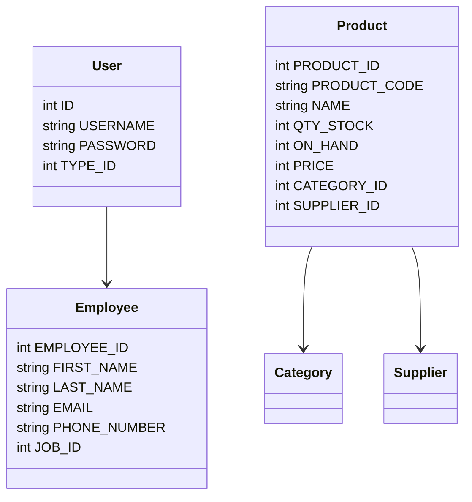
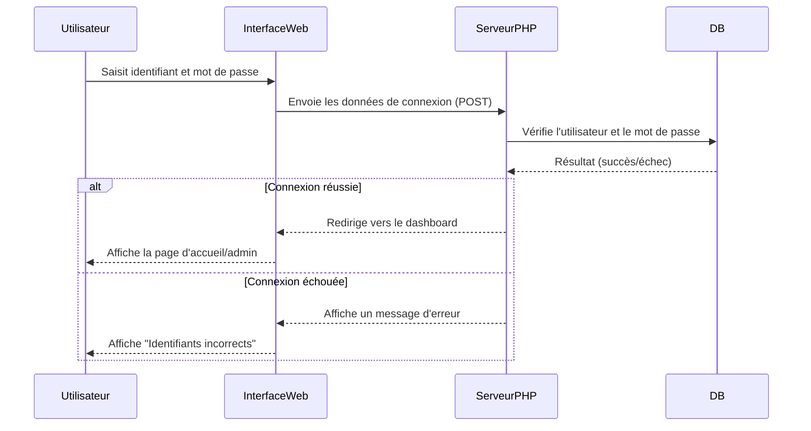
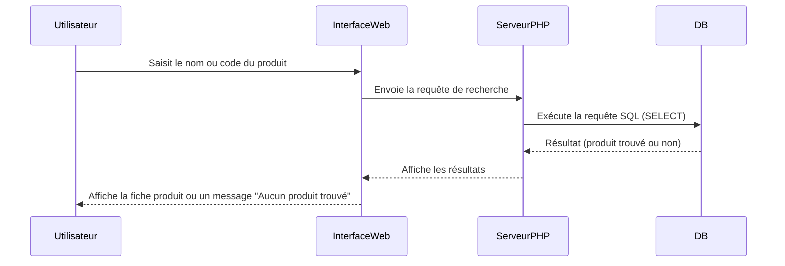
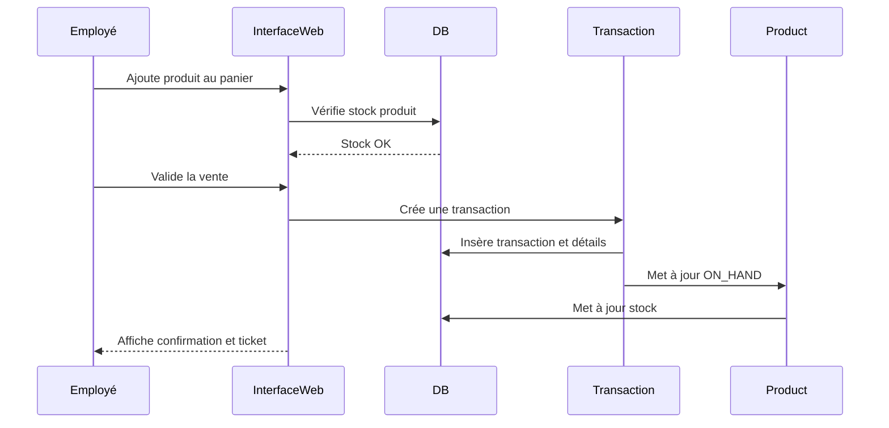

# CHAPITRE 1 : PRÉSENTATION DE LA SOLUTION

## I. IMPLEMENTATION DE LA SOLUTION

### 1. Aperçu du système
Le système de gestion de stock développé est une application web permettant de gérer l’ensemble des opérations liées aux produits, aux stocks, aux ventes, aux clients, aux fournisseurs et aux employés d’une entreprise. Il offre une interface moderne, des fonctionnalités avancées de reporting, ainsi qu’un assistant IA intégré pour interroger la base de données en langage naturel.

Les utilisateurs principaux sont :
- **Administrateur** : accès complet à toutes les fonctionnalités.
- **Employé** : accès restreint (consultation, ventes, etc.).

### 2. Présentation de l’environnement matériel de travail
Le système a été développé et testé sur l’environnement suivant :
- **Serveur local** : WAMP (Windows, Apache, MySQL, PHP)
- **Base de données** : MySQL
- **Langage serveur** : PHP 7+
- **Frontend** : HTML5, CSS3 (Bootstrap), JavaScript (jQuery, DataTables)
- **Navigateurs supportés** : Chrome, Firefox, Edge

#### 2.1 Cas d’utilisation : S’authentifier
L’utilisateur doit s’authentifier pour accéder au système. Selon son rôle, il accède à des fonctionnalités différentes.

**Diagramme de cas d’utilisation : S’authentifier**
```mermaid
usecaseDiagram
actor Utilisateur
Utilisateur --> (S'authentifier)
```

#### 2.2 Diagramme de cas d’utilisation : Gérer les comptes
Ce cas d’utilisation permet à l’administrateur de créer, modifier, supprimer et consulter les comptes utilisateurs (employés).

```mermaid
usecaseDiagram
actor Admin
Admin --> (Créer compte)
Admin --> (Modifier compte)
Admin --> (Supprimer compte)
Admin --> (Consulter comptes)
```

#### 2.3 Schéma du diagramme de classe du système
Voici un extrait du diagramme de classes du système :



### 3. Diagramme de séquences de l’authentification (connexion)
Ce diagramme illustre le processus d’authentification d’un utilisateur :



#### 3.1 Diagramme de séquences de la recherche d’un produit
Ce diagramme montre comment un utilisateur recherche un produit dans le système :



---

# Documentation complète – Système de gestion de stock

## Présentation générale
Ce système de gestion de stock (Stock Management System) est une application web PHP/MySQL permettant de gérer les produits, les stocks, les ventes, les clients, les fournisseurs et les employés d’une entreprise. Il propose une interface moderne, des rapports dynamiques, et un assistant IA intégré pour interroger la base en langage naturel.

## Fonctionnalités principales
- Gestion des produits (ajout, modification, suppression, consultation)
- Gestion des stocks (état, réapprovisionnement, ruptures)
- Gestion des clients et fournisseurs
- Gestion des employés et des rôles
- Gestion des ventes/transactions
- Génération de rapports et statistiques
- Authentification par rôle (admin, staff)
- Assistant IA (chatbot) pour requêtes dynamiques

## Structure de la base de données

```mermaid
dbml
Table product {
  PRODUCT_ID int [pk]
  PRODUCT_CODE varchar
  NAME varchar
  DESCRIPTION varchar
  QTY_STOCK int
  ON_HAND int
  PRICE int
  CATEGORY_ID int [ref: > category.CATEGORY_ID]
  SUPPLIER_ID int [ref: > supplier.SUPPLIER_ID]
  DATE_STOCK_IN varchar
}
Table category {
  CATEGORY_ID int [pk]
  CNAME varchar
}
Table supplier {
  SUPPLIER_ID int [pk]
  COMPANY_NAME varchar
  LOCATION_ID int
  PHONE_NUMBER varchar
}
Table customer {
  CUST_ID int [pk]
  FIRST_NAME varchar
  LAST_NAME varchar
  PHONE_NUMBER varchar
}
Table employee {
  EMPLOYEE_ID int [pk]
  FIRST_NAME varchar
  LAST_NAME varchar
  GENDER varchar
  EMAIL varchar
  PHONE_NUMBER varchar
  JOB_ID int
  HIRED_DATE varchar
  LOCATION_ID int
}
Table transaction {
  TRANS_ID int [pk]
  CUST_ID int [ref: > customer.CUST_ID]
  NUMOFITEMS varchar
  GRANDTOTAL varchar
  DATE varchar
  TRANS_D_ID varchar
}
Table transaction_details {
  ID int [pk]
  TRANS_D_ID varchar
  PRODUCTS varchar
  QTY varchar
  PRICE varchar
  EMPLOYEE varchar
  ROLE varchar
}
Table users {
  ID int [pk]
  EMPLOYEE_ID int [ref: > employee.EMPLOYEE_ID]
  USERNAME varchar
  PASSWORD varchar
  TYPE_ID int
}
```

## Diagramme de cas d’utilisation

```mermaid
usecaseDiagram
actor Admin
actor Employé
Admin --> (Gérer produits)
Admin --> (Gérer stocks)
Admin --> (Gérer clients)
Admin --> (Gérer fournisseurs)
Admin --> (Gérer employés)
Admin --> (Gérer ventes)
Admin --> (Générer rapports)
Admin --> (Utiliser assistant IA)
Employé --> (Gérer ventes)
Employé --> (Consulter stocks)
Employé --> (Utiliser assistant IA)
```

## Diagramme de séquence (exemple : Vente d’un produit)



## Processus d’intégration du chatbot IA

### 1. Création du backend PHP
- Un fichier `AssistantIA.php` reçoit les questions en AJAX (POST).
- Il analyse la question (mots-clés, patterns) et exécute la requête SQL adaptée.
- Il renvoie la réponse en JSON.

### 2. Création de l’interface utilisateur
- Un fichier CSS (`assistant-ia.css`) pour le style du chat.
- Un widget HTML/JS ajouté dans `footer.php` : bulle de chat en bas à droite, fenêtre de chat moderne.
- JS gère l’envoi des questions et l’affichage des réponses.

### 3. Fonctionnalités IA disponibles
- Questions sur les produits, stocks, ventes, clients, fournisseurs, employés, seuils critiques, top ventes, etc.
- Exemples :
  - "Quels produits sont en rupture ?"
  - "Quel est le chiffre d'affaires de l'entreprise ?"
  - "Qui sont nos clients ?"
  - "Faut-il réapprovisionner ?"
  - "Montre-moi nos différents produits"

### 4. Extension
- Pour ajouter une question, il suffit d’ajouter un nouveau bloc `elseif` dans `AssistantIA.php` avec le pattern et la requête SQL.
- Possibilité d’intégrer une API IA externe (ChatGPT, Dialogflow) pour des questions plus complexes.

## Sécurité et gestion des rôles
- Authentification obligatoire (login.php, processlogin.php)
- Deux rôles principaux : Admin (tous droits), Employé (accès restreint)
- Contrôle d’accès sur chaque page (redirection si non autorisé)

## Conseils de déploiement
- Hébergement PHP/MySQL (WAMP, LAMP, XAMPP, ou serveur web)
- Importer la base via `scms.sql`
- Configurer les accès à la base dans `includes/connection.php`
- Protéger les pages sensibles par authentification
- Sauvegarder régulièrement la base

## Exemples de questions IA
- "Quels produits sont disponibles ?"
- "Prix P001"
- "Produits coûtant plus de 10000"
- "Catégorie CPU"
- "Stock < 5"
- "Ventes aujourd’hui"
- "Chiffre d'affaires du mois"
- "Top ventes"
- "Clients"
- "Fournisseurs"
- "Produits de Asus"
- "Managers"
- "Produits jamais vendus"
- "Qui sont nos clients ?"
- "Leurs noms ?"
- "Faut-il déjà réapprovisionner ?"

---

*Document prêt à être converti en PDF (utilise Pandoc, Typora, ou un convertisseur Markdown vers PDF). Les diagrammes Mermaid peuvent être exportés en image via [Mermaid Live Editor](https://mermaid.live/).* 